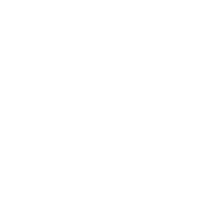

EAQL stands for "English Augmented Query Language" and is meant to take an educational spin on SQL to make stepping up to SQL less challenging while also lowering the requirements for including a databse in more simple projects. Provided with EAQL is EAQL-DB which is a lightweight, in-memory database built for learning and prototyping. It uses EAQL, an English-like query language that can be transpiled to SQL or run directly. Ideal for teaching data concepts to beginner programmers.

## Current Components
### EAQL
EAQL is a query language designed to make data querying more intuitive and human-readable. Inspired by SQL but structured around natural English patterns, EAQL lowers the barrier to data access for non-technical users while maintaining the full expressiveness of traditional SQL. Statements like `get all from users where age > 30` are transpiled directly into SQL (`SELECT * from users WHERE age > 5`), making it ideal for educational tools, internal analytics platforms, or simple projects.

Under the hood, EAQL features:
* A custom parser and compiler written in Rust
* Syntax error feedback designed for beginners

#### Transpiler REPL
The underlying query language, our initial implementation will provide a REPL (read-eval-print-loop) for quick test transpilation of EAQL to SQL.

#### Training REPL

### EAQL-DB

## Why this?
This project is meant to demonstrate end-to-end system design principles, language design, compiler architecture, and a deep database understaning. It balances accessibility and technical depth, making it both a useful tool and a showcase of engineering range. Not only do I want this to help others learn, but I also want to expand my own knowledge and deepen my understanding of compiler design principles and databases.

***Note:** This is for educational purposes only and should not be used in a production environment.*