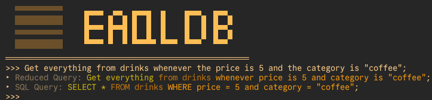
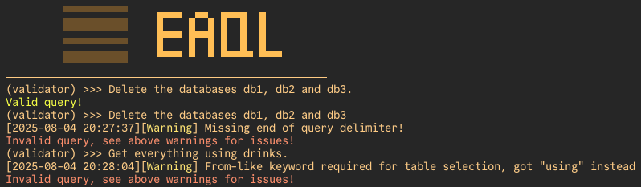

<div align="center">
    <picture>
        <source media="(prefers-color-scheme: dark)" srcset="./docs/images/logos/eaql-logo-white.svg">
        <source media="(prefers-color-scheme: light)" srcset="./docs/images/logos/eaql-logo-black.svg">
        
    </picture>
</div>

<p align="center">
    
    
    
    
    
</p>

**EAQL (English Augmented Query Language)** is a simplified, English-like query language designed as natural-language alternative to SQL. It's built for learners, educators, and tinkerers.

---

## Table of Contents
1. [What is EAQL?](#what-is-eaql)
2. [Documentation](#documentation)
3. [Why EAQL?](#why-eaql)

## What is EAQL?

EAQL makes data querying more human-readable. Inspired by SQL but based on natural English, it allows statements like:

```
Get me everything from drinks wherever the price is 5 and the category is "coffee" then sort it by price in ascending order.
```

...which transpiles to:

```sql
SELECT * FROM drinks WHERE price = 5 and category = "coffee" ORDER BY price ASC;
```

#### Features:

* Domain-specific computer language built in **Rust**
    * Easily expandable Lexer Architecture
    * Custom Recursive Descent parser built from scratch
    * EAQL AST (Abstract Syntax Tree) to SQL Transpiler
* Beginner-friendly error feedback
* Colored transpiler REPL for testing EAQL → SQL
    * 
* Query validator REPL for EAQL queries
    * 

---

## Documentation

Because this project is heavily learning-oriented, for myself and others, rather than being a production tool, we will be focused on a lot of in-depth documentation about the core architecture behind how the language and the associated database will work. As such, the organized documentation can be found by visiting [the documentation page](./docs/DOCUMENTATION.md).

For people wishing to learn how to make a programming language, database, or just curious about the inner workings of this project you can review the "Architecture" section of the documentation. If you wish to learn how to actually use EAQL as a whole please visit the "Usage" section of the documentation.

## Why EAQL?

This project demonstrates:

* End-to-end system design
* Domain-specific language (DSL) creation
* Compiler and transpiler architecture

It’s both a **learning tool for others** and a **personal deep dive** into compiler theory, and operating systems. With that being said, a lot of this is "learn as we go" so not every initial design choice will likely be optimal or even correct. I hope to continue iterating on this to keep learning and hopefully help others interested in creating a computer language, or database as a lot of my thoughts and realizations will be transferrable (i.e. lessons learned from [conditional-parsing](docs/eaql/architecture/CONDITIONAL.md) is transferrable to calculator design and operational heirarchies).

> ⚠️ *Note: EAQL is for educational purposes only. Not intended for production use.*