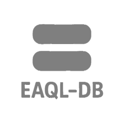

<p align="center"></p>

**EAQL (English Augmented Query Language)** is a simplified, English-like query language designed as a stepping stone to SQL. It's built for learners, educators, and simple projects where traditional SQL may feel intimidating or overly complex.

Bundled with **EAQL-DB**, a lightweight in-memory database, this project lowers the barrier to entry for understanding databases and query logic, making it perfect for prototyping, classrooms, or learning on your own.

---

## What’s Included

### EAQL (The Language)

EAQL makes data querying more human-readable. Inspired by SQL but based on natural English, it allows statements like:

```eaql
get all data from drinks and food where price is 5 in ascending order
````

...which transpiles to:

```sql
SELECT * FROM drinks, food WHERE price = 5 ORDER BY ASC;
```

#### Features:

* Custom parser and compiler written in **Rust**
* Beginner-friendly error feedback
* Transpiler REPL for testing EAQL → SQL

#### Coming Soon:

* **Training REPL** – Interactive learning tool for beginners

<p align="center"></p>

---

### EAQL-DB (The Database)

A lightweight, in-memory database that runs EAQL directly, no SQL backend required. Perfect for zero-setup experimentation and rapid prototyping.

<p align="center"></p>

---

## Why EAQL?

This project demonstrates:

* End-to-end system design
* Domain-specific language (DSL) creation
* Compiler and transpiler architecture
* Lightweight DB engine design

It’s both a **learning tool for others** and a **personal deep dive** into compiler theory, operating systems, and database internals.

> ⚠️ *Note: EAQL and EAQL-DB are for educational purposes only. Not intended for production use.*