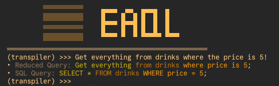
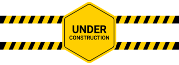

<div align="center">
    <picture>
        <source media="(prefers-color-scheme: dark)" srcset="./docs/images/logos/eaqldb-logo-white.svg">
        <source media="(prefers-color-scheme: light)" srcset="./docs/images/logos/eaqldb-logo-black.svg">
        
    </picture>
</div>

<p align="center"></p>

**EAQL (English Augmented Query Language)** is a simplified, English-like query language designed as an even simpler stepping stone into SQL. It's built for learners, educators, and simple projects where traditional SQL may feel intimidating or overly complex.

<!-- ~~Bundled with **EAQL-DB**, a lightweight in-memory database, this project lowers the barrier to entry for understanding databases and query logic, making it perfect for prototyping, classrooms, or learning on your own.~~ -->

---

## Table of Contents
1. [Whats Included](#whats-included)
2. [Documentation](#documentation)
3. [Why EAQL?](#why-eaql)

## What’s Included
### EAQL (The Language)

EAQL makes data querying more human-readable. Inspired by SQL but based on natural English, it allows statements like:

```
Get me everything from drinks wherever the price is 5 and the category is "coffee" then sort it in ascending order.
```

...which transpiles to:

```sql
SELECT * FROM drinks WHERE price = 5 and category = "coffee" ORDER BY ASC;
```

#### Features:

* Custom parser in **Rust**
* Beginner-friendly error feedback
* Transpiler REPL for testing EAQL → SQL
    * 
* Test REPL for testing validity of EAQL queries
    * 

---

### EAQLDB (The Database)
<!-- 
A lightweight, in-memory database that runs EAQL directly, no SQL backend required. Perfect for zero-setup experimentation and rapid prototyping. -->

<p align="center"></p>

---

## Documentation

Because this project is heavily learning-oriented, for myself and others, rather than being a production tool, we will be focused on a lot of in depth documentation about the core architecture behind how the language and the associated database will work. As such, the organized documentation can be found by visiting [the documentation page](./docs/DOCUMENTATION.md).

For people wishing to learn how to make a programming language, database, or just curious about the inner workings of this project you can review the "Architecture" section of the documentation. If you wish to learn how to actually use EAQL as a whole please visit the "Usage" section of the documentation.

## Why EAQL?

This project demonstrates:

* End-to-end system design
* Domain-specific language (DSL) creation
* Compiler and transpiler architecture
* Lightweight DB engine design

It’s both a **learning tool for others** and a **personal deep dive** into compiler theory, operating systems, and database internals. With that being said, a lot of this is "learn as we go" so not every initial design choice will likely be optimal or even correct. I hope to continue iterating on this to keep learning and hopefully help others interested in creating a computer language, or database as a lot of my thoughts and realizations will be transferrable (i.e. lessons learned from [conditional-parsing](docs/eaql/PARSER.md/#conditional-parsing) is transferrable to calculator design and operational heirarchies).

> ⚠️ *Note: EAQL and EAQL-DB are for educational purposes only. Not intended for production use.*