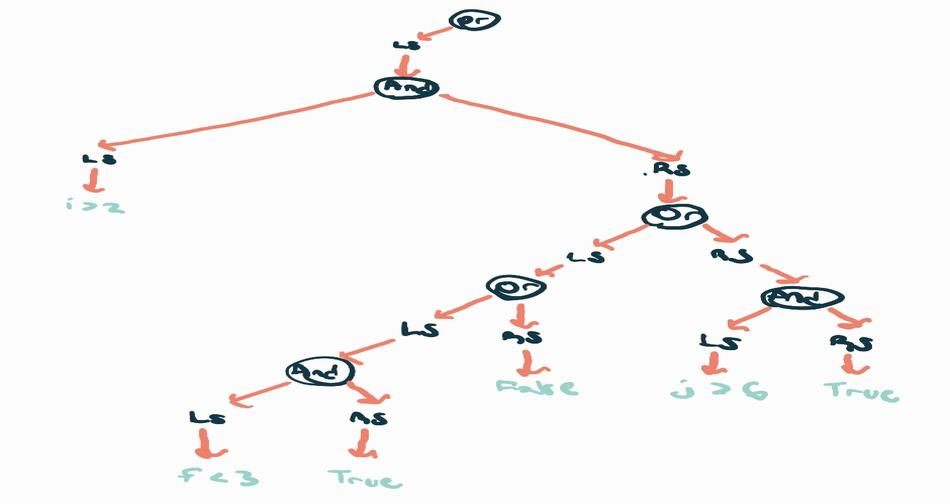

# eaql - Parser
## Basic Concept
All queries start as a query node which can be branched off into 3 different actions based on the first keyword (table searching, table mutation, database modification).

## Table Searching
Table searches are parsed into 4 subnodes. The table to be searched, the columns in that table, a filter which uses optional [conditional parsing](#conditional-parsing) to narrow down queries, and a post processor to do things like limit the number of results retrieved. The table and column parsing are pretty self explanatory.

### Conditional Parsing
- **Example Expression**: `i > 2 and ((f < 3) or j > 6)`
- **Example Parsed to AST**: 
- Rules:
    - If the next keyword is **And**, use the Right Side of the parent **And** node. If the next keyword is **Or**, the Right Side of the parent **And** node becomes `True`, and we use the Right Side of the nearest ancestor **Or** node to continue parsing. Otherwise, assuming the current number of openede parentheses is 0, all unevaluated nodes can have their children defaulted from this point (**Or** = False, **And** = True)
    - Open parentheses force an **Or** node to open as whatever child we currently are (this can be seen happening in the right side of the oldest **And** node in the diagram). We store the current number of open parentheses to keep track of their changes in order to ensure tree validity (number of open parentheses seen before processing a child node should never be less than after processing a child node) and a decrease indcates that we default our most recent **Or** ancestor using the aforementioned rules.

## Table Mutation

## Database Modification
