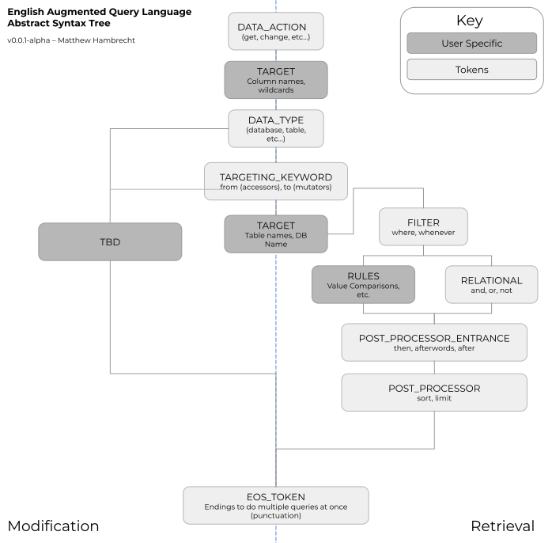

# eaql - Syntax

The core aim of eaql's syntax structure is to convert the core goals achieved by other database query languages like sql into a more english form.

## Tokenization
Sample Query:
- `get all data from drinks where price is 5 and category is coffee then sort ascending.`

Sample Tokenization (UNK = Not Fully Defined Yet)
- `<DATA_ACTION> <WILDCARD_TOKEN> <TARGETING_KEYWORD> drinks <FILTER> ((price <ASSIGNMENT> 5) <RELATIONAL> ((category <ASSIGNMENT> coffee)) <POST_PROCESSOR_ENTRANCE> <POST_PROCESSOR> <UNK> <EOS_TOKEN>`

## Abstract Syntax Tree
